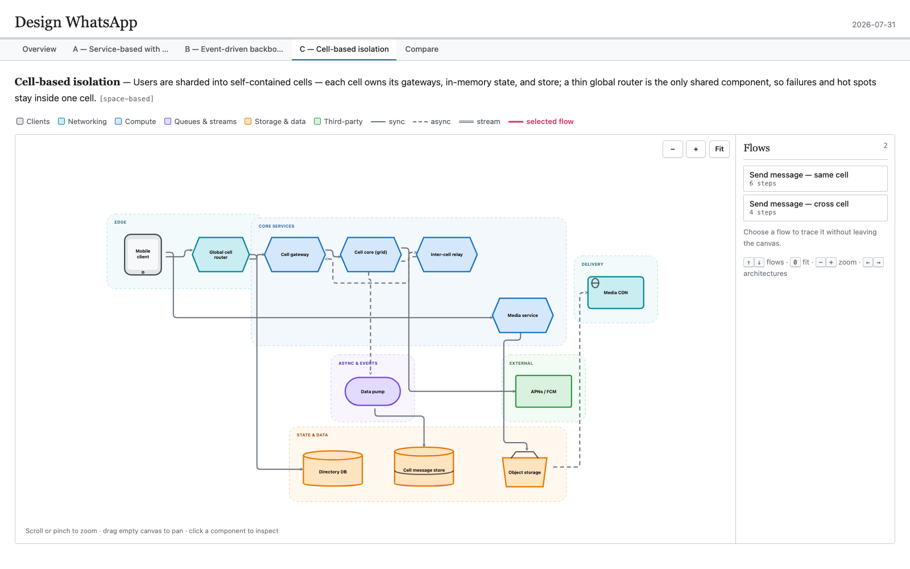

# System Design

**System design from evidence, not vibes.**

`/system-design` takes you from an incomplete idea or an existing codebase to a defensible architecture decision. It sizes the ask before it starts, and answers small or already-settled questions directly instead of manufacturing a document. When the decision earns the process, it discovers what the repository already proves, asks you only for the requirements it cannot recover, derives the system’s entities, invariants, interfaces, data and consistency model, scale envelope, and critical flows, then fully draws only the candidate architectures the evidence leaves viable. It compares their strengths and weaknesses and recommends one. Outputs a self-contained single-page HTML report, a structured `design.json` source of truth, and a durable `DESIGN.md` that records the reasoning and can be resumed in future agent sessions. Designs with structured persistence include intuitive database schemas—essential fields, keys, relationships, and indexes—rather than executable DDL.



## Installation

Pick one path. Both load the same skill, so installing both makes `/system-design` appear twice in the picker.

### Codex, Claude Code, Cursor, and other compatible agents

```bash
npx skills@latest add pinchen147/system-design-skill
```

Choose which agent should receive the skill. The files remain editable, and you decide when to pull updates:

```bash
npx skills update
```

### Claude Code plugin

Use the plugin when you want a managed, versioned installation:

```bash
claude plugin marketplace add pinchen147/system-design-skill
claude plugin install system-design-skill@pinchen-skills
```

Claude namespaces marketplace skills to prevent collisions. Invoke this installation as:

```text
/system-design-skill:system-design
```

Update it with:

```bash
claude plugin update system-design-skill@pinchen-skills
```

## Quick start

Run the skill with whatever context you already have. It will discover the rest from the repository or ask for the decisions that remain open.

The skill is model-invocable when the intent is to make or evaluate an architecture decision: designing, re-architecting, scaling, sizing, recording an ADR, or choosing among datastore, consistency, partitioning, replication, cache, or queue topologies. A technology explanation is not a trigger, and neither is implementation debugging that merely mentions those mechanisms. A bounded choice whose envelope forces one answer gets a direct answer; competing architecture structures run the full process. Type the command when you want it explicitly.

The examples below use the standalone name `/system-design`. If you installed the Claude plugin, use `/system-design-skill:system-design` instead.

### Evolve an existing system

```text
/system-design Redesign our notification pipeline to support regional failover
```

### Design a new system

```text
/system-design Design a collaborative document editor for 10 million DAU
```

Repository work is the primary path. Greenfield work uses the same process without an existing Architecture 0.

## Examples

- [Evolve an existing repository](docs/demos/repository-evolution.md) — reconstruct Architecture 0 from the code, then compare migration-aware evolutions.
- [Design a greenfield system](docs/demos/greenfield-design.md) — turn a WhatsApp prompt into measurable requirements, capacity math, and complete architectures.

## The complete journey

### 1. Sizes the ask before running the process

The process is expensive, so the skill spends it only where it pays. It sketches the envelope first and checks it against the anti-overengineering gates. If the ask lands below them, or a recorded decision already forces the answer, the skill names the gate or the decision and answers directly in a paragraph — no report, no `design.json`, no `DESIGN.md`.

When the process does run, the skill starts with the simplest production-viable candidate. It draws another only when the envelope and invariants leave a genuinely different structure viable on a load-bearing axis. Closed alternatives remain one-line rejections; three is a ceiling, not a target.

### 2. Starts with evidence

In an existing repository, the skill reads the architecture docs, ADRs, domain vocabulary, configuration, schemas, APIs, queues, storage code, and critical user-facing flows before asking anything.

It reconstructs the current system as **Architecture 0**:

- what each component owns;
- where authoritative state lives;
- how requests and events move through the system;
- which decisions are already settled;
- which constraints a redesign must preserve;
- where the current architecture is under pressure.

In greenfield work, it extracts the same starting facts from the prompt.

### 3. Gets the requirements out

The skill turns missing requirements into a focused decision frontier. It never asks you for facts the repository already answers.

Questions are numbered, grouped, and paired with a recommended default, so you can answer precisely or accept the recommendations. It covers only decisions capable of changing the architecture:

- core actors, flows, entities, and excluded scope;
- invariants that must never break;
- latency, availability, durability, and consistency targets;
- DAU, concurrency, peak QPS, payload sizes, growth, burst, skew, and fan-out;
- privacy, retention, abuse, and compliance boundaries;
- team size, budget, hosting, migration, and rollout constraints;
- the characteristics that matter most for this system.

There are at most three short rounds. Anything still unknown becomes a visible assumption rather than a hidden guess.

### 4. Defines the system before drawing it

Before choosing components, the skill makes the system model explicit:

- **Entities** — the durable things the product manages.
- **Invariants** — what must remain true across retries, failures, and concurrency.
- **Interfaces** — each boundary's style and transport, trust boundary, deadline, retryability and owner, backpressure, consistency and idempotency scope, compatibility direction, and failure result.
- **Critical flows** — the happy paths plus failure and recovery paths.
- **Sources of truth** — authoritative stores separated from caches, indexes, and other derived views.

This prevents the design from becoming a fashionable component list with no correctness model.

### 5. Runs the operating envelope

The skill derives the numbers that can change the design:

- average and peak reads and writes;
- storage growth and retention;
- ingress and egress bandwidth;
- concurrent connections and worker demand;
- cache footprint;
- burst ratios, hot keys, uneven tenants, and fan-out.

It shows the derivations, verifies the arithmetic, and challenges physically contradictory requirements before proposing an architecture.

### 6. Fixes the data and consistency model

Topology that is correct for the wrong data model is not a design, so this is settled before anything is drawn. For every core entity the skill states:

- how it is represented in memory and at rest;
- its identity scheme;
- which component holds ordering authority;
- how conflicts resolve, per field class;
- the point at which a write becomes durable;
- the garbage-collection or compaction story.

For every structured store it also draws a readable database schema: the table or collection name, load-bearing fields and human-readable types, primary/foreign/partition/sort keys, important relationships and indexes, and brief authority or retention notes. These are design artifacts, not executable SQL, migrations, or exhaustive physical schemas.

Where the difficulty lives here rather than in the component graph — collaborative editing, consensus, ledgers, indexes — this becomes the axis the candidates differ on.

### 7. Constructs the candidate architectures

A run fully draws the simplest production-viable candidate. It adds a directly comparable candidate only when that candidate survives the envelope and invariants and changes a load-bearing structural, data-model, consistency, cost, or operability axis. An option closed by a requirement, gate, or failure mode remains a one-line rejection instead of a report tab. Three candidates is the ceiling.

Each drawn candidate includes its complete clients, networking, compute, state, queues, external dependencies, connections, flows, operational behavior, migration cost, advantages, and weaknesses. Swapping one database does not count as a different architecture; swapping the ordering authority or the conflict-resolution model does.

After the envelope identifies the protected invariant, the skill loads only the matching archetype pack. It composes packs only for independent invariants and never loads the full pattern catalog by default.

In repository mode, each candidate is an explicit evolution of Architecture 0 rather than a greenfield rewrite that ignores migration.

### 8. Pressure-tests the trade-offs

The candidates are compared against the priorities established during requirements discovery. Every recommendation must be justified by an envelope number, an invariant, a named failure mode, or an operating constraint.

The highest-pressure decisions receive deeper treatment, including:

- retries, timeouts, duplicates, and partial completion;
- idempotency and reconciliation;
- failover and blast radius;
- observability and rollout;
- what breaks first;
- the measurement that would overturn the recommendation.

A run is complete only when critical flows reach named final effects, invariants and ownership are explicit, dependencies and authoritative stores carry bounded failure/recovery contracts, candidates name what fails first, and the recommendation is falsifiable. Unresolved facts remain visible assumptions or measurements, and artifacts must pass structural and render checks.

### 9. Produces the report and durable design

The skill writes the structured source first, generates the Markdown design from it, and renders the standalone report.

The HTML opens with the entire architecture fitted in view. Each candidate remains fully drawn on its own tab. You can:

- scroll or pinch to zoom and drag the empty canvas to pan;
- use `−`, `+`, or `Fit` for direct viewport control;
- select a flow from the permanent right sidebar to trace every numbered step;
- click a component to inspect its responsibility, technology, connections, and flows;
- compare every candidate and its trade-offs without leaving the page.

The report is self-contained and makes no network requests. Copy it, email it, or open it directly in any browser.

## What appears on disk

| Artifact | Purpose |
|---|---|
| `docs/design/<slug>/design.json` | Source of truth for requirements, estimates, components, flows, candidates, and the recommendation |
| `docs/design/<slug>/DESIGN.md` | Durable design document for humans and future agent sessions |
| `$TMPDIR/system-design-<slug>.html` | Self-contained interactive report, regenerated from `design.json` |
| `docs/adr/NNNN-<slug>.md` | Offered in repository mode once you pick a winner, so future sessions do not re-litigate it |

Outside a Git repository, `design.json` and `DESIGN.md` are written under `./<slug>/`. When the ask lands below the anti-overengineering gates, nothing is written at all — you get the answer and the gate that closed it.

Run `/system-design` again for the same system and it resumes from `design.json` instead of restarting discovery. Rendered HTML is always generated from the JSON and is never the source of truth.

## What the skill will not do

- Run the full process, or produce artifacts, for a decision that is small and reversible.
- Ask for information it can recover from the repository.
- Hide missing requirements behind confident prose.
- Recommend distributed machinery without a number, invariant, or failure mode that earns it.
- Present one preferred design and two incomplete straw men.
- Treat caches, indexes, or queues as authoritative without saying so.
- Hand-edit the rendered HTML instead of updating the design source.

## How it is built

The skill is plain Markdown plus a self-contained report renderer:

| File | Responsibility |
|---|---|
| [`SKILL.md`](skills/system-design/SKILL.md) | The complete architecture workflow |
| [`INTERVIEW.md`](skills/system-design/INTERVIEW.md) | Requirements frontier and question protocol |
| [`HEURISTICS.md`](skills/system-design/HEURISTICS.md) | Decision rules, capacity references, and comparison characteristics |
| [`ARCHETYPES.md`](skills/system-design/ARCHETYPES.md) | Canonical system patterns and failure modes |
| [`HTML-REPORT.md`](skills/system-design/HTML-REPORT.md) | `design.json` schema and output contract |
| [`EXAMPLES.md`](skills/system-design/EXAMPLES.md) | Conditional BAD/GOOD contrasts for making a generic first draft operationally specific |
| [`assets/report-template.html`](skills/system-design/assets/report-template.html) | Interactive renderer with no runtime dependencies |
| [`scripts/render_report.py`](skills/system-design/scripts/render_report.py) | Injects `design.json` into the template |

Everything is inspectable and editable. The renderer runs locally and sends no repository or design data to a service.

## Support and security

- Ask usage questions or report bugs through [GitHub Issues](https://github.com/pinchen147/system-design-skill/issues).
- Report vulnerabilities privately through [GitHub Security Advisories](https://github.com/pinchen147/system-design-skill/security/advisories/new).
- Read the package’s data-handling and review guidance in [`SECURITY.md`](SECURITY.md).

## License

MIT. Use it, adapt it, and make it fit your own engineering process.
